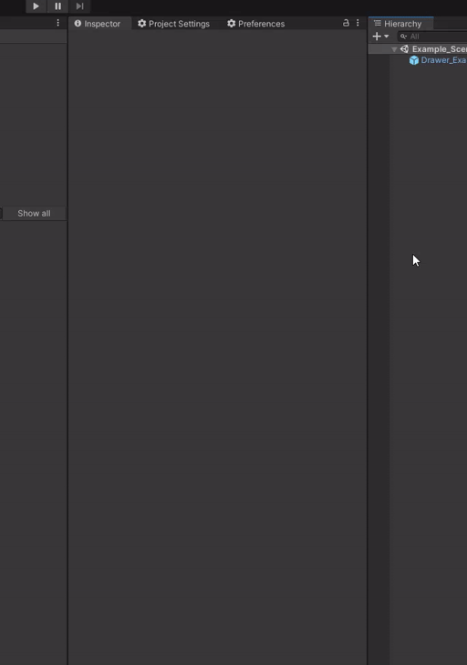

# AboveAverageInspector
A custom inspector drawer written using UIElements / UI Toolkit, because I wanted something I could organize into groups

### NOTE : Above-Average Inspector is a work in progress! 

While the majority of the functionality is present, there most assuredly are still bugs.  
(Known-Issue: Currently, the List items [ + ] Add and [ - ] Remove buttons are not working properly)

| With Above-Average Inspector           | Original Inspector                     |
| -------------------------------------- | -------------------------------------- |
|  |  |

### Categorize your fields
Use the ```[UICategory(name:"", order:0, expand:true)]``` attribute to draw your field in a category, order the categories, and decide if you want the category expanded by default.   


Uncategorized fields are automatically placed in a "Default" category.


## Animated Foldouts



## Compatibility with other Inspector modifications (Odin Inspector, possibly others, etc)
Odin Inspector injects it's drawers into default Unity inspectors. Above-Average Inspector is not forceful about it. As such, once Odin Inspector is added to a project it's drawers overtake as the default inspector drawer. 

If you would like AAI to still draw it's inspector changes, for whatever MonoBehaviours or ScriptableObjects you would like to use AAI you can create a simple CustomEditor for that object deriving from the AAIDefaultEditor and place it into any 'Editor' folder.

Using the included ExampleComponent in this project, if you would like to use AAI's drawer over Odin, follow these steps:

```
NOTE:
 I could make this a selectable and automated process with code generation. 
 
 I am interested to hear if anyone would like this or if just creating them manually 
 and having the control is preferred.)
```

1. In the 'Assets' folder of your project, create a new folder called 'Editor'
2. Within Assets/Editor, create a new script called "ExampleComponentEditor" 
3. Place the following code in the script):


Example is located in: Assets/instance.id/Example/Scripts/Editor/ExampleComponentEditor.cs
```cs
using UnityEditor;

namespace instance.id.AAI.Editors
{
    [CustomEditor(typeof(ExampleComponent))]
    public class ExampleComponentEditor : AAIDefaultEditor { }
}
```

if your script requires being in a custom namespace, change it appropriately, but then add the AAI/Editors namespaces as using statements as seen below:

```cs
using instance.id.AAI.Editors;
using UnityEditor;

namespace YourCustom.Namespace
{
    [CustomEditor(typeof(ExampleComponent))]
    public class ExampleComponentEditor : AAIDefaultEditor { }
}
```

This will product the following result: 
The ExampleComponent object (Left) will use AAI, the Example2Component will use Odin Inspector (Right)


Tested with Odin Inspector 3.0.0.3 beta


---

